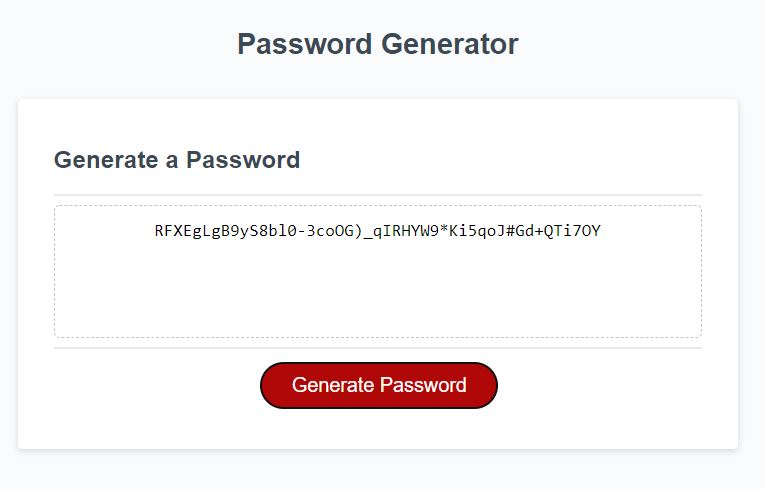

# ESMT Coding Boot Camp Homework-03

# JavaScript Password Generator

## Description

This is a password generator, which prompts the user to select:

- the length of the password (between 8 and 128 characters)
- And, whether to include:
  - lower case letters
  - upper case letters
  - numbers
  - special characters

If the user selects a length outside of the specified range, or if they fail to select at least one of the four character types, then they see an error and are prompted to correct their selection.

The Repo contains the index.html page, a CSS style sheet, a javascript file, and this readme file.

Link to deployed app:
https://queenmcsteve.github.io/password-generator/
Screenshot:

Copyright 2021 Queen McSteve (contact via GitHub)

Permission is hereby granted, free of charge, to any person obtaining a copy of this software and associated documentation files (the "Software"), to deal in the Software without restriction, including without limitation the rights to use, copy, modify, merge, publish, distribute, sublicense, and/or sell copies of the Software, and to permit persons to whom the Software is furnished to do so, subject to the following conditions:

The above copyright notice and this permission notice shall be included in all copies or substantial portions of the Software.

THE SOFTWARE IS PROVIDED "AS IS", WITHOUT WARRANTY OF ANY KIND, EXPRESS OR IMPLIED, INCLUDING BUT NOT LIMITED TO THE WARRANTIES OF MERCHANTABILITY, FITNESS FOR A PARTICULAR PURPOSE AND NONINFRINGEMENT. IN NO EVENT SHALL THE AUTHORS OR COPYRIGHT HOLDERS BE LIABLE FOR ANY CLAIM, DAMAGES OR OTHER LIABILITY, WHETHER IN AN ACTION OF CONTRACT, TORT OR OTHERWISE, ARISING FROM, OUT OF OR IN CONNECTION WITH THE SOFTWARE OR THE USE OR OTHER DEALINGS IN THE SOFTWARE.
