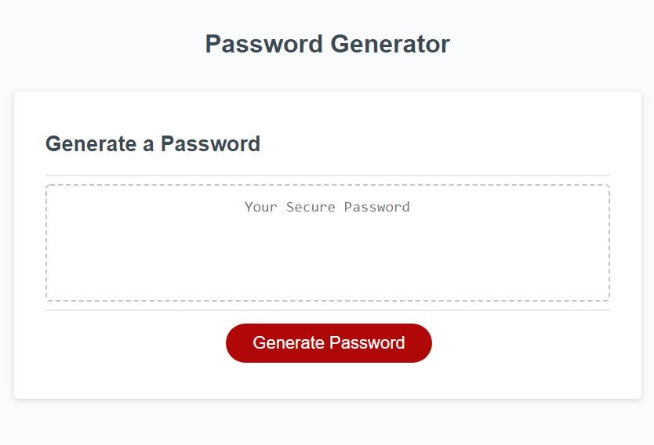

# ESMT Coding Boot Camp Homework-03
# JavaScript Password Generator

## Description
This is a password generator, which prompts the user to select:
+ the length of the password (between 8 and 128 characters)
+ And, whether to include:
    + lower case letters
    + upper case letters
    + numbers
    + special characters
If the user selects a length outside of the specified range, or if they fail to select at least one of the four character types, then they see an error and are prompted to correct their selection.

The Repo contains the index.html page, a CSS style sheet, a javascript file, and this readme file.

Link to deployed app:
TBA
Screenshot:
